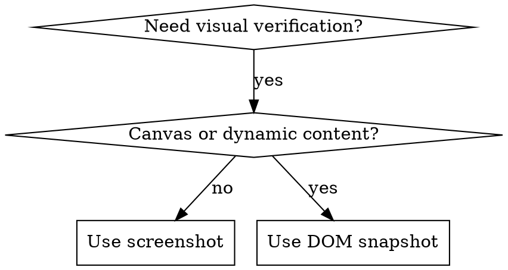

# tauri-test-cli

Visual testing CLI for Tauri apps. Start server once, send commands anytime.

## Installation

```bash
npm i -g tauri-test-cli   # Global install
npm i tauri-test-cli      # Local install (use with npx)
npx tauri-test-cli ...    # No install needed
```

## Quick Reference

| Action | Command |
|--------|---------|
| Status | `tauri-test-cli status` |
| Start server | `tauri-test-cli server --app ./path/to/app --xvfb &` |
| Click | `tauri-test-cli click "selector"` |
| Type | `tauri-test-cli type "selector" "text"` |
| Screenshot | `tauri-test-cli screenshot --output /tmp/screen.png` |
| DOM snapshot | `tauri-test-cli snapshot --output /tmp/dom.yaml` |
| Wait appear | `tauri-test-cli wait "selector" --timeout 3000` |
| Wait gone | `tauri-test-cli wait "selector" --gone --timeout 5000` |
| Eval JS | `tauri-test-cli eval "document.title"` |
| Stop | `tauri-test-cli stop` |

## Workflow

```bash
# 1. Check/start server
tauri-test-cli status
tauri-test-cli server --app ./path/to/app --xvfb &
# Wait for: {"status":"ready","port":9222}

# 2. Run commands (auto-connect to server)
tauri-test-cli click "button"
tauri-test-cli screenshot --output /tmp/screen.png

# 3. View results with Read tool
# 4. Cleanup when done
tauri-test-cli stop
```

## Screenshot vs Snapshot



- **Screenshot**: Visual appearance, layout verification
- **DOM snapshot**: Element existence, text content, state verification
- **Canvas limitation**: Screenshots can't capture `<canvas>` - use snapshots

## Common Pattern: Form Test

```bash
tauri-test-cli type "input[name=email]" "user@test.com"
tauri-test-cli click "button[type=submit]"
tauri-test-cli wait ".loading" --timeout 3000
tauri-test-cli wait ".loading" --gone --timeout 5000
tauri-test-cli snapshot --output /tmp/result.yaml
```

## Cleanup (if stuck)

```bash
tauri-test-cli stop
tauri-test-cli cleanup
pkill Xvfb 2>/dev/null
```
